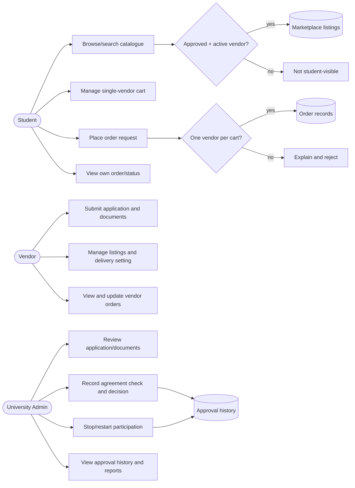

# Use case diagram

```mermaid
flowchart LR
  Student([Student]) --> Browse[Browse/search catalogue]
  Student --> Cart[Manage single-vendor cart]
  Student --> Place[Place order request]
  Student --> Track[View own order/status]
  Vendor([Vendor]) --> Apply[Submit application and documents]
  Vendor --> Listing[Manage listings and delivery setting]
  Vendor --> Fulfil[View and update vendor orders]
  Admin([University Admin]) --> Review[Review application/documents]
  Admin --> Decide[Record agreement check and decision]
  Admin --> Governance[Stop/restart participation]
  Admin --> Audit[View approval history and reports]
  Browse --> Active{Approved + active vendor?}
  Active -->|yes| ListingData[(Marketplace listings)]
  Active -->|no| Hidden[Not student-visible]
  Place --> Single{One vendor per cart?}
  Single -->|yes| Order[(Order records)]
  Single -->|no| Reject[Explain and reject]
  Decide --> History[(Approval history)]
  Governance --> History
```

